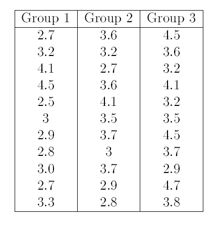

# Master on Health Molecular Technologies 

## Exercises - Descriptive Statistics

Create your own folder for your R session. All your analysis will happen in
this directory. At any point during this session you may save the workspace
so that you can come back to the same session latter.


+Three groups of babies with the same weight (born) approximately
were distributed randomly in order to investigate if the weight (Kg)
rose during the first 6 months. The three groups were given dierent
diets. The results are as follows:



**Exercise 1** Create three different variables, which correspond to the groups
weight. Use these to create a data.frame named Data1.

<details><summary>Click Here to see the answer</summary><p>

```{r}

g1<-c(2.7,3.2,4.1,4.5,2.5,3,2.9,2.8,3.0,2.7,3.3)
g2<-c(3.6,3.2,2.7,3.6,4.1,3.5,3.7,3,3.7,2.9,2.8)
g3<-c(4.5,3.6,3.2,4.1,3.2,3.5,4.5,3.7,2.9,4.7,3.8)
observ<-c(g1,g2,g3)

Data1<-data.frame("g1"=g1,"g2"=g2,"g3"=g3)

```

</p></details>

<br/>

**Exercise 2**: Store your data in a .txt file in your working directory. Latter we
will use it again.

<details><summary>Click Here to see the answer</summary><p>

```{r}
write.table(Data1,file="Data1.txt",col.names=TRUE,sep="",row.names=FALSE)

```

</p></details>

<br/>


**Exercise 3**: Compare the three groups using box-plots and save it into a .pdf
file.

<details><summary>Click Here to see the answer</summary><p>


```{r}

pdf("bx.pdf") 
 bx<-boxplot(g1,g2,g3,names=c("g1","g2","g3")
 dev.off()

```

</p></details>

<br/>


**Exercise 4**: Create a error plot with 95 % CI and another with a SD. Plot them
into a same window and compare. Install the _psych_ package and
use the function _error.bars()_.

<details><summary>Click Here to see the answer</summary><p>

```{r}
group<-c("G1","G2","G3")
library(psych)
par(mfrow=c(1,2))
error.bars(Data1,alpha=0.05,bars=TRUE,sd=TRUE)  # error bar with sd
error.bars(Data1,alpha=0.05,bars=TRUE)  #error bar with CI

```

</p></details>

<br/>

**Exercise 5**: Get summary statistics for the 1st group.

<details><summary>Click Here to see the answer</summary><p>

```{r}
summary(Data1$g1)

```

</p></details>

<br/>


**Exercise 6**: Calculate the skewness using the _moments_ package and plot the
kernel density estimate using the function _density()_ for the three
groups on the same plot. Characterize the three groups concerning
skewness.

<details><summary>Click Here to see the answer</summary><p>

```{r}
library(moments)
skewness(Data1)
plot(density(g1),main="kernel densities")
lines(density(g2),col="red")
lines(density(g3),col="blue")
legend(4.5,0.8,legend=c("g1","g2","g3"),lwd=1,col=c("black","red","blue"))

```

</p></details>

<br/>

