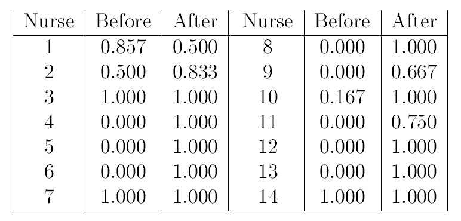

# Master on Health Molecular Technologies 

## Exercises - Hypothesis Tests

### Use function ls(package:stats) to produce the list of specific functions available.

**Exercise 1**: The body temperature data set DataP4.txt contains the body temperature (Fahrenheit) and the gender of 130 volunteers, 65 men and 65 women. Answer the following question justifying the distributions considered to perform the tests.

<br/>

**a)**: Is the mean body temperature of human adults really 98.6F (37C)? (Ignore differences due to gender)

<details><summary>Click Here to see the answer</summary><p>

```{r}

a<-read.table("DataP4.txt",header=T)
length(a[,1])  
view(a)

summary(a[,1])

var(a[,1])

cv<-var(a[,1])/mean(a[,1])*100

cv

hist(a[,1],main='Body temperature',col='pink')
boxplot(a[,1],main='Body temperature',col='gold')

qqnorm(a[,1])
qqline(a[,1])
shapiro.test(a[,1])
t.test(a[,1],mu=98.6,alternative="two.sided")

```

</p></details>

<br/>

**b)**: Is the mean body temperature of women higher than the mean
body temperature of men?

<details><summary>Click Here to see the answer</summary><p>

```{r}
w.women<-a[a[,2]=="female",1]

w.women

w.men<-a[a[,2]=="male",1]

w.men

summary(w.women)

summary(w.men)


par(mfrow=c(1,2))

hist(w.women,main='women',col='pink')

hist(w.men,main='men',col='blue')


par(mfrow=c(1,2))

boxplot(w.women,main='women',col='pink')

boxplot(w.men,main='men',col='blue')


boxplot(w.women,w.men)


qqnorm(w.women)

qqline(w.women)

qqnorm(w.men)

qqline(w.men)

bartlett.test(list(w.women,w.men))

shapiro.test(w.women)

shapiro.test(w.men)

t.test(w.women,w.men,alternative="one.sided")

```

</p></details>

<br/>


**c)**: Construct a 90% confidence interval for the difference of means for both genders. Use this interval to test the hypothesis of the difference of mean values (mu_women- mu_men) being equal to one.

<details><summary>Click Here to see the answer</summary><p>

```{r}
t.test(w.women,w.men,alternative="two.sided",confidence=0.9)$conf.int


# If "1" belongs to the CI 90%, do not reject H0.

```
</p></details>

<br/>

**Exercise 2**:During an experiment using laboratory animals the following data on renal corticol blood flow (ml/g/min) during control conditions and during the administration of a certain anesthetic were recorded.

<br/>


<br/>
<br/>

**a)** Can one conclude on the basis of these data that the anesthetic retards renal corticol blood flow?

<details><summary>Click Here to see the answer</summary><p>

```{r}


corticol<-matrix(c(2.35,2.55,1.95,2.79,3.21,2.97,3.44,2.53,2.58,2.66,2.31,3.43,2.37,1.82,2.98,2,1.71,2.22,2.71,1.83,2.14,3.72,2.05,2.10,2.58,1.32,3.70,1.59,2.07,2.15),15,2)

diff<-c(corticol[,1]-corticol[,2]) # control-anesthetic

diff

summary(diff)

hist(diff,col='red')

boxplot(diff,col='gold')

qqnorm(diff)

qqline(diff)


shapiro.test(diff)


t.test(corticol[,1],corticol[,2],alternative="greater",paired=TRUE)


```

</p></details>

<br/>

**Exercise 3**: Nurses in an inner-city hospital were unknowingly observed on their use of latex gloves during procedures for which glove use is recommended.
The nurses then attended a presentation on the importance of glove
use. One month after the presentation, the same nurses were observed
again. Here are the proportions of procedures for which each nurse
wore gloves:

<br/>



<br/>
<br/>

**a)** Why is a one-sided alternative proper here? Why must matched pairs methods be used?

<details><summary>Click Here to see the answer</summary><p>

+ To verify if there is an improvement in the behaviour of the nurses after the presentation.

+ Because the statistical units (nurses) are the same on both evaluation procedures.

</p></details>

<br/>

**b)** Does the test indicate that the presentation was helpful? Use an adequate hypothesis testing after verifying the assumptions.

<details><summary>Click Here to see the answer</summary><p>

```{r}
nurses<-matrix(c(0.857,0.5,0,1,0.5,0.833,0,0.667,1,1,0.167,1,0,1,0,0.75,0,1,0,1,0,1,0,1,1,1,1,1),14,2,byrow=TRUE)


#veriying assumptions

#Normality

diff<-c(nurses[,2]-nurses[,1])  #After-Before
diff
shapiro.test(diff)  #testing for normality


# Performing the wilcoxon-test

wilcox.test()

wilcox.test(diff, alternative =  "greater")  #non-parametric test Wicoxon
           


```

</p></details>

<br/>


**c)**: Find the 90% confidence interval.

<details><summary>Click Here to see the answer</summary><p>

```{r}

wilcox.test(diff, alternative =  "two.sided",conf.level = 0.90)


```

</p></details>

<br/>


**Exercise 4**: We have the following R commands and results:
<br/>


<br/>

**a)** Write down the null and the alternative hypothesis, significance level (alfa), n1 and n2 corresponding to this output. What is the estimated standard error of
the difference between the mean values? What R command would you
use to find the critical vale for the hypothesis used? (The value at the boundary of the rejection region is called the critical value)

<details><summary>Click Here to see the answer</summary><p>

+ H0:mu1=mu2 vs H1: mu1<mu2, alfa=0.05, n1=10, n2=10.

+ standard error of the difference between means=2.057

```{r}
-qt(0.95,18)

```

</p></details>

<br/>


**Exercise 5**:Three groups of babies with the same weight (born) approximately were distributed randomly in order to investigate if the weight (Kg) rose during the first 6 months. The three groups were given different diets. The results are as follows:
<br/>


<br/>

**a)** Is it plausible to say that the variance of the weight gained on the three diet groups are equal?

<details><summary>Click Here to see the answer</summary><p>

```{r}

g1<-c(2.7,3.2,4.1,4.5)
g2<-c(3.6,3.2,2.7,3.6,4.1)
g3<-c(4.5,3.6,3.2,4.1,3.2)
observ<-c(g1,g2,g3)
tratam<-rep(c("g1","g2","g3"),c(4,5,5))

dados<-data.frame(tratam,observ)
tratam<-factor(dados$tratam)


#write.table(dados,file="DataP4_5.txt",sep="",col.names=TRUE,row.names=TRUE)  

#dados<-read.table(DataP4_5)

# Bartlett test - comparing variances: three groups
??bartlet.test
bartlett.test(observ,tratam)  #we need two variables 


```

</p></details>

<br/>
 
 
 
**b)** These diets can be considered different at a significance level of 5%?

<details><summary>Click Here to see the answer</summary><p>
 
```{r}

# ANOVA - comparing means: three groups

aov(observ~tratam)
summary(aov(observ~tratam))

```
</p></details>

<br/>
