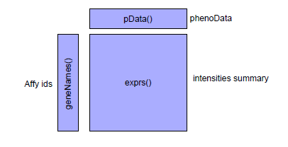

# Master on Health Molecular Technologies 

## Exercises - Microarrays

###  Preprocessing Analysis

The **exprSet** object:

* Intensities summary is loaded in an **exprSet** object.
* **phenoData** contains the covariates associates to each array and it is inherited by the objects derived from AffyBatch object.




<br/>


The data gives results from a 2x2 factorial experiment on MCF7 breast
cancer cells using Affymetrix HGU95av2 arrays. The factors in this experiment were estrogen (present or absent) and length of exposure (10 or 48hours). The aim of the study is to identify genes which respond to estrogen and to classify these into early and late responders. Genes which respond
early are putative direct-target genes while those which respond late are probably downstream targets in the molecular pathway.

This data is from the estrogen data package on the [Bioconductor website])(http://www.bioconductor.org/packages/release/data/experiment/html/estrogen.html)

<br/>


**1.**: Install the required packages: _estrogen_, _hgu95av2_, _hgu95av2cdf_. We will look at a dataset containing 8 Affymetrix experiments with two repetition per level. In this experiment the impact of estrogen on cancercells is being studied.


```{r}

source("http://bioconductor.org/biocLite.R")
biocLite()  #install the basic packages of bionconductor
library(Biobase)
if (!requireNamespace("BiocManager", quietly = TRUE))
    install.packages("BiocManager")
BiocManager::install("affy", version = "3.8")

```


```{r}
biocLite("estrogen")
library(estrogen)
library(affy)
biocLite("hgu95av2.db")
library(AnnotationDbi)
library(org.Hs.eg.db)
library(DBI)
library(hgu95av2.db)
biocLite("hgu95av2cdf")
library(hgu95av2cdf)


```

<br/>
<br/>

**2.** Find the directory where the CEL files are using _system.file_. The directory path should end in .../R/library/estrogen/extdata. Show the content of that directory and set current path to this.


The function _system.file_ here is used to find the subdirectory extdata of the estrogen package on your computer's harddisk. To use your own data, set datadir to the appropriate path instead.

<br/>

```{r}
datadir<-system.file("extdata", package = "estrogen")

datadir

dir(datadir) #List the Files in a Directory/Folder

#setwd(datadir)  #changes the working directory to the folder datadir


```

<br/>
<br/>

**3.** The file _estrogen.txt_ contains information on the samples that were hybridized onto the arrays. Look at it in a text editor.
Again, to use your own data, you need to prepare a similar file
with the appropriate information on your arrays and samples,
to load it into a _phenoData_ object.


Phenotypic data consists of the concentrations of RNA from two different samples, along with the ID of the scanner. The function _pData_ can be used to access this information.


phenoData objects are where the Bioconductor stores information about
samples, for example, treatment conditions in a cell line experiment
or clinical or histopathological characteristics of tissue biopsies. The
header option lets the _read.phenoData_ function know that the first
line in the file contains column headings, and the _row.names_ option
indicates that the first column of the file contains the row names.

<br/>


```{r}
pd<- read.AnnotatedDataFrame("estrogen.txt", header = TRUE, sep = "",row.names = 1)

pData(pd)
mode(pd)   #S4 object
pd


```

<br/>


The _pData_ function gives access to an object _phenoData_. We can choose a relevant column from the sample annotation to
identify biological groups of interest In this case we want to use the information available for the samples. We use the function _grep_ to extract this information and store it in a separate object, _fac_.


```{r}

fac <- colnames(pData(estrogen))[grep("estrogen",colnames(pData(estrogen)))]
fac

```


<br/>
<br/>


**4.** Load the data from the CEL files as well as the phenotypic data
into an AffyBatch object and call it estrogen.


<br/>

```{r}

estrogen<-ReadAffy(filenames = rownames(pData(pd)), phenoData = pd,verbose = TRUE)
estrogen

```

<br/>
<br/>


**5.** Look at the CEL file images and nd if there are spatial artifacts.
The image function allows us to look at the spatial distribution of the
intensities on a chip.


Image plots represent the intensity measured for each probe in the
physical position that the probe occupies in the array surface. Higher
intensities are represented in darker. This kind of plots can be used to
easily detect spatial artifacts in the array surface or even in the scanner.
Therefore they are useful for controlling the quality of the array images.

<br/>

```{r}
image(estrogen)

```

<br/>
<br/>


**6.** Read the file _bad.cel_ and look at the image of that dataset.

<br/>

```{r}

bad<-ReadAffy()  #read all cel files in directory
image(bad)

```

<br/>
<br/>


```{r}
Data <- ReadAffy()
image(bad[,1])

```
<br/>
<br/>


**7.**  Compare the intensity distribution across the chips.

To examine probe intensity behavior for a number of different arrays
we can use the hist and boxplot methods. These boxplots are useful
for identifying differences in the level of raw probe-intensities between arrays. Differences between arrays in the shape or center of the distribution often highlight the need for normalization.

Density plots shows the density of the probe intensities. Data from
each microarray is represented by a dierent line. The plot is useful
to visualize differences in the distributions of the arrays. For instance arrays that show a shifted distribution may need a relocation of their intensities while arrays with more or less kurtosis will need a scale change to be normalized. Usually the density will be skewed to the right showing how just few genes have a really big expression levels.

<br/>

```{r}
hist(estrogen)
boxplot(estrogen)
```

<br/>
<br/>


**8.** Practise subsetting the _AffyBatch_ object estrogen. Make sure
you understand what sets of data you are getting from each
command below.
<br/>

```{r}

class(estrogen)
slotNames(estrogen)
estrogen
cdfNames(estrogen)
annotation(estrogen)
nrow(estrogen)
ncol(estrogen)
gnames<-geneNames(estrogen)
length(gnames)
gnames[3:5]

```
<br/>


Obtain the expressions values of the chips and the probe-level
PM and MM intensities.


The _exprs_ slot contains a matrix with columns corresponding to chips
and rows to individual probes on the chip.
<br/>

```{r}

par(mfrow=c(1,2))
boxplot(pm(estrogen))
boxplot(log2(pm(estrogen))) 
boxplot(mm(estrogen))

```
<br/>
<br/>


**9.** Plot probe intensities for gene "1012at" using the following
commands.


<br/>

```{r}

matplot(pm(estrogen,"1012_at"),type = "l", xlab = "Probe No.",ylab = "PM Probe intensity")
matplot(t(pm(estrogen, "1012_at")), type = "l", xlab = "Array No.", ylab = "PM Probe intensity")

```
<br/>

Compare the variability between probes with the variability between
arrays.

<br/>
<br/>


**10.** Obtain the MA plots just considering the chips 1, 3, 5 and 7.
Use the PM probes.


The function mva.pairs in the affy package can be used for M versus A
plots, where M is a log ratio (in base 2) and A is an average log intensity (in base 2).


MA-plots are designed to compare two intensity measurements. They
are widely used in the analysis of two color channel arrays but can indeed be useful in two by two comparison of single channel arrays like the ones from Affymetrix. It provide a matrix of plots with all the pair comparisons between arrays. For two given signals (usually in a logarithmic scale), MA-plots represent in the vertical axis the intensity difference (M) and in the horizontal axis the average intensity (A). Ideally, if there are no systematic differences between the two arrays being compared, we expect the points in the plot to be concentrated around the horizontal axis M=0 for all values of A. Deviation from such ideal fit indicate big dependencies between the arrays that may need to be dismissed before any relevant biological information is drawn from the data. Remember that one of our assumptions is that few genes are
differentially expressed between experiments. Such small differences
should not be translated into a trend of the MA-plots but remain embedded in the overall variability of the points. A trend in the plots
is usually due to a lot of pairs of intensities and therefore indicates systematic non-biological differences between the arrays rather than
differences in few the expression of few genes. In order to highlight
such trends a lowess curve is added to the plots.

<br/>

```{r}

mva.pairs(pm(estrogen[,c(1,3,5,7)])) 

```
<br/>
<br/>


**11.** Load the _arrayQualityMetrics_ library and use the _arrayQualityMetrics()_ function to run quality assessment before normalization. 

* A report named QMreport.html is produced in the subdirectory
QAraw.
* The report contains a series of diagnostic plots as .png images.
All the images are saved in the subdirectory QAraw.
* This will take a few minutes considering the amount of information
you can get from the report.RL.


<br/>

```{r}

biocLite("arrayQualityMetrics")
library(arrayQualityMetrics)
library(preprocessCore)
arrayQualityMetrics(expressionset = estrogen, outdir = "QAraw", force = TRUE, do.logtransform = TRUE, intgroup = fac)

```
<br/>
<br/>


**12.** Obtain the degradation, NUSE and RLE plots.

<br/>

```{r}

biocLite("affyPLM")
library(affyPLM)  
rna.deg.obj<-AffyRNAdeg(estrogen)
plotAffyRNAdeg(rna.deg.obj)  #degradation plot
fitPLM<-fitPLM(estrogen)  # fitPLM creates an object to use on the plots RLE and
RLE(fitPLM)
NUSE(fitPLM)

```
<br/>
<br/>


**13.** We view the process of going from probe-level intensities to gene-level expression measures as a three-step procedure consisting of: (i) background adjustment; (ii) normalization; (iii) summarization. The _affy_ package provides implementations for a number of methods for each
of these steps: (i) background correction: e.g., none, MAS 5.0, convolution; (ii) normalization: e.g., probe-level quantile, cyclic loess,
contrast loess; (iii) summarization: e.g., MAS 4.0, MAS 5.0, MBEI
(Li Wong, 2001), median polish for additive linear model (Irizarry
et al., 2003). The Robust Multichip Average (RMA) method refers to
the sequence: convolution background adjustment, probe-level quantile
normalization, and median polish summarization for gene-specific additive models with probe and chip effects. These methods are discussed
in detail in the vignette builtinMethods, which can be viewed using
openVignette("affy"). To list available methods for AffyBatch ob-
jects:


<br/>

```{r}

bgcorrect.methods
normalize.AffyBatch.methods
pmcorrect.methods
express.summary.stat.methods

```
<br/>
<br/>

Compare the _rma_ and _mas_ background correction using boxplots. 

Compare the constant, invariantset, quantiles and loess normalization methods using boxplots.


<br/>
<br/>


**14.** Summarization is the final stage in preprocessing Affymetrix GeneChip data. It is the process of combining the multiple probe intensities for each probeset to produce an expression value.


Bioconductor packages provide a number of functions that carry out
summarization to produce gene expression values: _expresso_ and _threestep_, provide the ability to produce expression measures using a wide variety of user specified preprocessing methods. Other functions are optimized for computing specific expression measures such as _rma_, _gcrma_, _vsn_ are also available.


_expresso_ provides quite general facilities for computing expression
summary values. It allows most background adjustment, normalization and summarization methods to be combined. The trade-off is that
expresso is often considerably slower than the functions that have been
optimized for producing specific expression measures.


The _affyPLM_ package provides the threestep function that can be
used to compute very general expression measures. Because _threestep_
is primarily implemented in compiled code it is typically faster than
expresso. _threestep_ always returns expression measures in log2 scale.
The background.method, normalize.method and summary.method arguments of _threestep control_ which preprocessing methods are used
at each stage.

Compute expression measures where the ideal mismatch is
subtracted from PM, then quantile normalization between arrays is carried out, and probesets are summarized by using a
robust average.
Compute expression measures where only the PM probes are
used, rma background correction were made, then constant
normalization between arrays is carried out, and probesets
are summarized by using tukey biweigth.
Compute expression measures where only the PM probes are
used, with no background correction, then invarianset normalization between arrays is carried out, and probesets are
summarized by using liwong.

<br/>
<br/>


**15.** Get the expressions levels of the estrogen data using the _rma_
which will create an object of class _exprSet_. In order to run
_rma_ on the estrogen data, you must either have the CDF (Chip
Definition File) package hgu95av2cdf installed. Save _rma_ data
to a file for further analysis.

<br/>


```{r}

eset.rma<-rma(estrogen)   # An S4 object
boxplot(exprs(eset.rma))  # expression levels of each array
hist(eset.rma)
MAplot(eset.rma)  #eset.rma is an expressionset object in log2scale

write.exprs(eset.rma,file="estrogenrma.txt")  # saving data in your directory
eset.rma.data<-read.table("estrogenrma.txt")   # read data from a file

```

<br/>


You will get a S4 object of class "exprSet". By typing the name
of the object and pressing enter, we are invoking the "show" method
for objects of this class. To see the R code for this "show" method,
you can type: getMethod("show","exprSet"). To see R code for the "show" method when applied to other types of objects, you can type:
getMethods("show").


The function justRMA can be used instead of rma in cases where there
are a large number of CEL les to process and no other low-level analysis
is desired.

<br/>
<br/>

**16.** Use the _arrayQualityMetrics_ function to run quality assessment after normalization. Explore the report after normalization and decide if to remove any array before proceeding with the analysis.
<br/>

```{r}

arrayQualityMetrics(expressionset = eset.rma, outdir = "QArma",
force = TRUE, do.logtransform = FALSE, intgroup = fac,spatial=TRUE,grouprep=TRUE)

```

