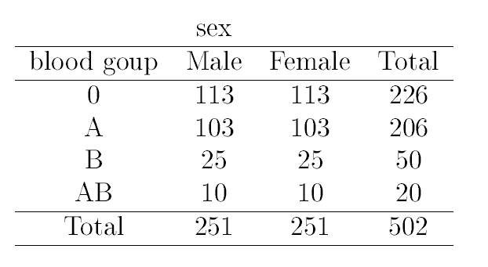

# Master on Health Molecular Technologies 


## Exercises - Probability

Random numbers form a basic tool for any simulation study. Simulations
require the ability to generate random numbers. On a computer, it is only
possible to generate "pseudo-random" numbers which for practical purposes
behave as if they were drawn randomly. All random number generators essentially work as follows:


**(a)** A seed number is needed as input for the process of generating a
random number. This seed can be supplied by the user or the computer
generates the seed e.g. as a function of the data.

**(b)** The seed number is put into mathematical functions that eventually
return a random number and a new seed that will be used to generate the
next random number.


In R, "set.seed" declares the seed for the random generator. If we use this
command before a random number generating statement, we are able to retain the same number each time we provide the same seed.
R has the ability to sample with and without replacement. That is, choose
at random from a collection of things such as the numbers 1 through 6 in
the dice rolling example. The sampling can be done with replacement (like
dice rolling) or without replacement (like a lottery). By default sample sam-
ples without replacement each object having equal chance of being picked.

You need to specify _replace=TRUE_ if you want to sample with replacement.
Furthermore, you can specify separate probabilities for each if desired.


**Exercise 1**: Suppose that in a group of 502 people they were classiffed by blood
group and sex as follows:



A person is picked at random from this group.

**a)** What is the probability that she is female?

**b)** Given that she is female, what is the probability that her blood group is A or AB?

<details><summary>Click Here to see the answer</summary><p>

```{r}
a<-251/502
b<-(103+10)/251

```

</p></details>

<br/>

**Exercise 2**: Suppose that it is known that a fraction .001 of the people in a town have tuberculosis (TB). A TB test is given with the properties: If the
person has TB the test will indicate it with probability .999. If does
not have TB then there is a probability .002 that the test erroneously
indicates that he does. For one person selected at random the test
shows that he has TB. What is the probability that he really does?

<details><summary>Click Here to see the answer</summary><p>

```{r}
p<-0.001 #P(X=1)
p_11<-0.999 #P(T=1|X=1)
p_10<-0.002 #P(T=1|X=0)

p.11<-p_11*p/(p_11*p+p_10*(1-p))  #P(X=1|T=1)
p.11


```

</p></details>

<br/>


**Exercise 3**: Suppose that there is a 2% chance that a mouse exposed to a certain
carcinogen will develop cancer. What is the probability that two or
more mice will develop cancer within a group of 60 experimental mice
exposed to the causative agent? Use both the binomial distribution
and the Poison approximation to the binomial.


<details><summary>Click Here to see the answer</summary><p>
```{r}

#using Binomial   X ~ Bi(60,0.02), P(X>=2)

1-pbinom(1,60,0.02)

1-sum(dbinom(0:1,60,0.02))


#using aproximation to Poisson X~P(60*0.02)

1-ppois(1,60*0.02)


```
</p></details>

<br/>

**Exercise 4**:Suppose that for certain microRNA of size 20 the probability of a purine is binomially distributed with probability 0.7.

a) What is the probability of 14 purines?

b) What is the probability of less than or equal to 14 purines?

d) By what probability is of the number of purines between 10 and 15?

e) How many purines do you expect?

<details><summary>Click Here to see the answer</summary><p>

```{r}
a<-dbinom(14,20,0.7)
b<-pbinom(14,20,0.7)
d<-pbinom(15,20,0.7)-pbinom(10,20,0.7)+dbinom(10,20,0.7)
e<-mean_10<-20*0.7
print("output",c(a,b,c,d))
```

</p></details>

<br/>

**Exercise 5**: The distribution of the expression values of the ALL patients on the Zyxin gene are distributed according to N(1.6; 0.42).

a) Compute the probability that the expression values are smaller than
1.2?

b) What is the probability that the expression values are between
1.2and 2.0?

c) What is the 15th quantile of that distribution. What does it mean?

d) Use rnorm to draw a sample of size 1000 from the population and
compare the sample mean and standard deviation with that of the
population.

<details><summary>Click Here to see the answer</summary><p>

```{r}
a.11<-pnorm(1.2,1.6,0.42)
b.11<-pnorm(2,1.6,0.42)-pnorm(2,1.6,0.42)
c.11<-pnorm(2.4,1.6,0.42)-pnorm(0.8,1.6,0.42)
d.11<-rnorm(1000,1.6,0.42)
sample_1000<-mean(d.11)

```

</p></details>

<br/>


